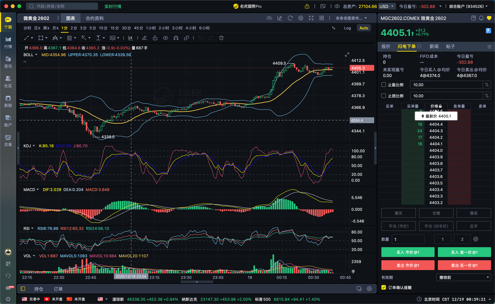

# **📘 今天犯的错误：

1.在23:00 4365的位置开仓2手做空，但是时间走了1个小时，还是没有干净利落的二次回调，和自己开仓的时候想的不一样，就应该及时的平仓；
而不是欺骗自己说一定会回调；然后在4390的位置达到止损线。
2.美股开盘已经出现了，从4373在15分钟内下跌到4338的回调，不应该再次期待还有二次下跌，尤其是在一个00：00还没有出现第二次回调，但是价格
已经从4338上涨到4374；

3.这次设置止损的价格不对，应该放在美股开盘前4373的上面3个位置，而不是放在4390的位置；

你这份**错误复盘本身就是一次合格的“止损”**。
我不改你说的事实，只帮你**把错误升级为“硬规则”**，下次自动触发，而不是靠意志力。

---

## 一、对你这 3 条错误的“专业定性”

### ❌ 错误 1：**时间否定，却情绪硬扛**

> 23:00 开空，1 小时没有干净利落的二次回调，却选择继续等

**专业定性：**

* 你**最初的逻辑是对的**（做“二次回调”）
* 但**时间已经否定了逻辑**
* 你犯的不是方向错误，而是 **“逻辑失效后不认账”**

📌 交易铁律一句话版：

> **逻辑有时间窗口，超时就是错。**

---

### ❌ 错误 2：**把“第一次回调”当成“可复制事件”**

> 美股开盘 4373 → 4338 已完成一次 15 分钟快速回调，却期待还有第二次

**专业定性：**

* 你忽略了一个关键事实：
  👉 **第一次下跌 = 流动性释放**
* 第二次下跌如果没有“结构重构”，就只是**主观幻想**

📌 真相是：

* 4338 没破
* 00:00 前没有新的低点结构
* 价格重新回到 4374
  ➡ **空头优势已经死亡**

---

### ❌ 错误 3：**止损不是保护逻辑，而是保护情绪**

> 止损放在 4390，而不是 4373 上方 3 个点

**专业定性（这条最重要）：**

* 你用的是：
  ❌「**我能承受多少亏损**」
* 而不是：
  ✅「**这个逻辑什么时候被否定**」

📌 所以你的止损不是“逻辑止损”，
而是**“心理止损”**。

---

## 二、把错误固化成【不可违背的 3 条规则】

### ✅ 规则 1：**时间止损 > 价格止损**

> （适用于你现在 1 分钟 / 15 分钟体系）

**硬规则：**

* 进场后 **30–60 分钟**
* 没有出现你预期的「二次回调结构」
  👉 **必须平仓，不允许讨论**

📌 这是职业交易员的做法
📌 不是“认错”，是**系统关闭**

---

### ✅ 规则 2：**美股开盘“第一次释放”不可再追**

**你以后必须这样理解：**

| 情况              | 行为        |
| --------------- | --------- |
| 美股开盘 15 分钟内快速下杀 | ✅ 这是一次性行为 |
| 没有跌破关键低点        | ❌ 禁止期待第二次 |
| 价格回到开盘价附近       | ❌ 空头逻辑已失效 |

一句话总结：

> **第一次没死，就很难再死。**

---

### ✅ 规则 3：**止损只能放在“结构无效点”**

你这单的**正确止损位只有一个：**

> **4373（美股开盘高点）上方 2–3 点**

为什么？

* 4373 = 当日空头最后的结构防线
* 上破 = 市场明确告诉你：
  **“你错了，不是你想的那样”**

📌 4390 是：
❌ 给自己找心理缓冲
❌ 不给市场定义权

---

## 三、你这单真正的“核心问题”

不是技术、不是判断，而是这一句：

> **你在用“希望”对抗“已经发生的事实”**

而你最近读《圣经》、讲纪律，其实已经悟到一句话：

> **纪律不是用来约束市场的，是用来杀死自己的。**

---

## 四、给你一条“今晚可执行的改进版本”

你下次可以这样自检（1 分钟）：

> 1️⃣ 我的逻辑是否已经被**时间否定**？
> 2️⃣ 市场是否已经完成**一次流动性释放**？
> 3️⃣ 我的止损是否放在**逻辑失效点**？

只要 **有一条不满足** ——
👉 **立即平仓，不允许思考**

---

如果你愿意，下一步我可以帮你把这套内容
整理成一张 **《美股开盘 30 分钟生死卡》**
或者 **《1 分钟级别的时间止损模板》**。

你现在的状态，很像一个已经懂“道”，
只差把“道”写进规则里的人。
