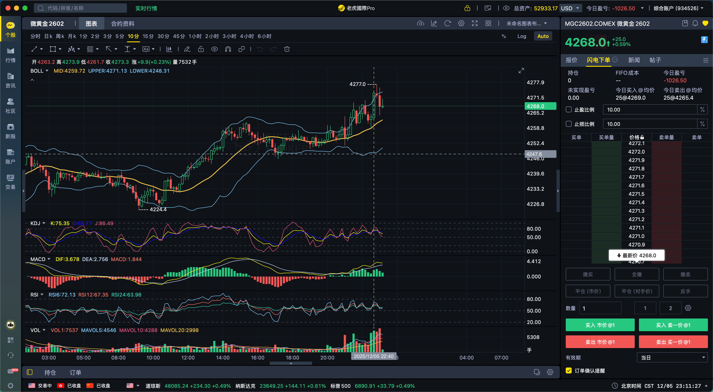
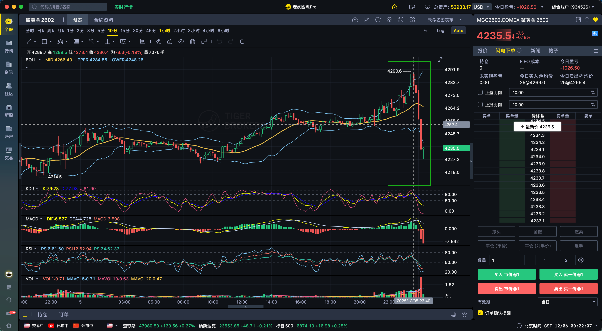

 
 
# **📘 今天犯的错误：

1.趋势不明朗的时候，不能使用15手这个的仓位；
应该使用5手或者2手来测试趋势是否和自己的想法相同；

或者不开仓，继续观望；

从今天美股开盘后，K线的表现可以知道做空趋势不想之前那样干净利落；而且从过去的三天到今天，
做空动能越来越小；或者说今天美国那边的做空机构就没有参与；
---

# **📘 今天学到的知识：

美过做空机构砸盘的时间可能会换到北京时间的凌晨左右开始；放在美股看盘之后的1个小时也有可能是放在美股开盘后的2个小时内；

因为昨天MGC的趋势干净利落，就想当然的认为今天也是这样；
这是概率问题，并不是100%这样；

说明现在黄金的短期趋势还是以震荡为主；

交易就是这样，不可能抓到每一波行情；

加油吧；好好看，好好学；